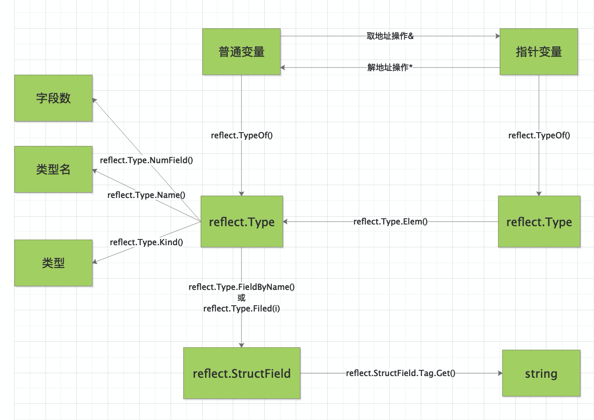

## reflect





使用 reflect.TypeOf() 函数可以获得任意值的类型对象（reflect.Type），程序通过类型对象可以访问任意值的类型信息。下面通过例子来理解获取类型对象的过程：

```go
package main

import (
	"fmt"
	"reflect"
)

type Student struct {

	Name string
	Age  int
}

func main() {

	var stu Student

	typeOfStu := reflect.TypeOf(stu)

	fmt.Println(typeOfStu.Name(), typeOfStu.Kind())  // Student struct
}

```

代码说明如下:

- 第16行，定义一个int类型的变量
- 第18行，通过reflect.TypeOf()取得变量stu的类型对象typeOfStu,类型为reflect.Type
- 第20行中，通过typeOfStu类型对象的成员函数，可以分别获取到 typeOfStu 变量的类型名为 Student，种类（Kind）为 struct。

#### 获取成员反射信息

下面代码中，实例化一个结构体并遍历其结构体成员，再通过 reflect.Type 的 FieldByName() 方法查找结构体中指定名称的字段，直接获取其类型信息。

反射访问结构体成员类型及信息:

```go
package main

import (
    "fmt"
    "reflect"
)

func main() {
  
    // 声明一个空结构体
    type cat struct {
        Name string
   
        // 带有结构体tag的字段
        Type int `json:"type" id:"100"`
    }
  
    // 创建cat的实例
    ins := cat{Name: "mimi", Type: 1}
  
    // 获取结构体实例的反射类型对象
    typeOfCat := reflect.TypeOf(ins)
  
    // 遍历结构体所有成员
    for i := 0; i < typeOfCat.NumField(); i++ {
      
        // 获取每个成员的结构体字段类型
        fieldType := typeOfCat.Field(i)
      
        // 输出成员名和tag
        fmt.Printf("name: %v  tag: '%v'\n", fieldType.Name, fieldType.Tag) // name: Type  tag: 'json:"type" id:"100"'
    }
  
    // 通过字段名, 找到字段类型信息
    if catType, ok := typeOfCat.FieldByName("Type"); ok {
      
        // 从tag中取出需要的tag
        fmt.Println(catType.Tag.Get("json"), catType.Tag.Get("id"))  // type 100
    }
}
```


